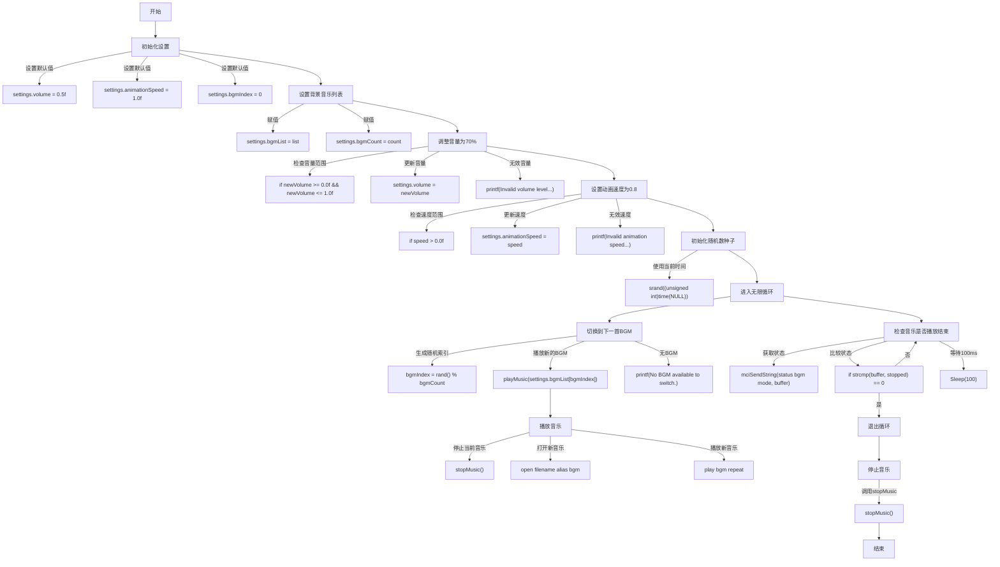

```mermaid
graph TD;
    A[开始] --> B[初始化设置]
    B -->|设置默认值| C1[settings.volume = 0.5f]
    B -->|设置默认值| C2[settings.animationSpeed = 1.0f]
    B -->|设置默认值| C3[settings.bgmIndex = 0]
    B --> D[设置背景音乐列表]
    D -->|赋值| E1[settings.bgmList = list]
    D -->|赋值| E2[settings.bgmCount = count]
    D --> F[调整音量为70%]
    F -->|检查音量范围| G1[if newVolume >= 0.0f && newVolume <= 1.0f]
    F -->|更新音量| G2[settings.volume = newVolume]
    F -->|无效音量| G3["printf(Invalid volume level...)"]
    F --> H[设置动画速度为0.8]
    H -->|检查速度范围| I1[if speed > 0.0f]
    H -->|更新速度| I2[settings.animationSpeed = speed]
    H -->|无效速度| I3["printf(Invalid animation speed...)"]
    H --> J[初始化随机数种子]
    J -->|使用当前时间| J1["srand((unsigned int)time(NULL))"]
    J --> K[进入无限循环]
    K --> L[切换到下一首BGM]
    L -->|生成随机索引| M1["bgmIndex = rand() % bgmCount"]
    L -->|播放新的BGM| M2["playMusic(settings.bgmList[bgmIndex])"]
    L -->|无BGM| M3["printf(No BGM available to switch.)"]
    M2 --> N[播放音乐]
    N -->|停止当前音乐| N1["stopMusic()"]
    N -->|打开新音乐| N2[open filename alias bgm]
    N -->|播放新音乐| N3[play bgm repeat]
    K --> O[检查音乐是否播放结束]
    O -->|获取状态| O1["mciSendString(status bgm mode, buffer)"]
    O -->|比较状态| O2["if strcmp(buffer, stopped) == 0"]
    O -->|等待100ms| O3["Sleep(100)"]
    O2 -->|是| P[退出循环]
    O2 -->|否| O
    P --> Q[停止音乐]
    Q -->|调用stopMusic| Q1["stopMusic()"]
    Q1 --> R[结束]
```
